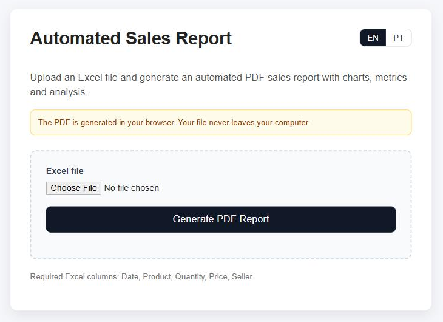
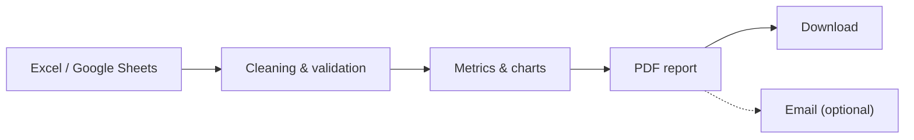
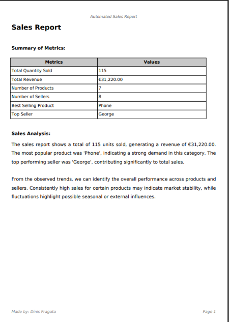
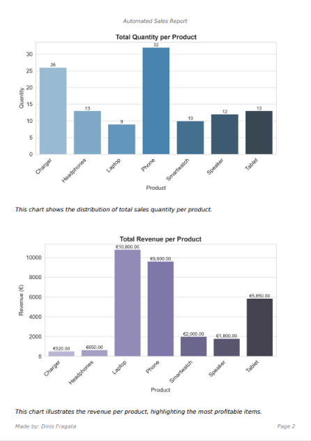
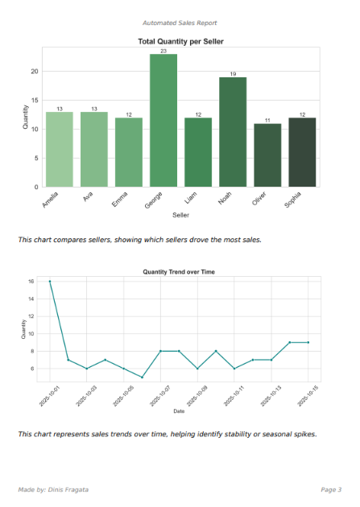

# Automated Sales Report System

Turn a raw sales spreadsheet into a polished PDF report (metrics, charts and written analysis) in one click, and optionally deliver it by email.

Built to reduce repetitive reporting tasks and improve business decision-making.

**[Try the live demo](https://dinisfragata.pt/projects/pdf-automation-report/demo)** · [Example PDF](assets/examples/Example_sales_report.pdf)

<p align="center">
  
</p>

---

## Key Features

- Import data from Excel or Google Sheets
- Automatic data cleaning and validation
- Sales insights and performance metrics
- Charts generated automatically (quantity and revenue per product, quantity per seller, trend over time)
- Professional PDF export, with amounts in euros (€)
- Web demo with an **EN / PT** switch
- PDF generation directly in the browser: the file never leaves your computer
- Optional email delivery (Zoho SMTP), only to an address confirmed with a code

## How It Works



Required columns: `Date`, `Product`, `Quantity`, `Price`, `Seller`.

## Screenshots

### Raw data spreadsheet


### PDF output

<p>
  
  
  
</p>

_Pages 1 to 3 of the [example report](assets/examples/Example_sales_report.pdf)_

## Web Demo and API

The demo is a static page (`templates/index.html`, hosted on Vercel) with an optional FastAPI backend.

### Where the PDF is generated

`templates/config.js` (a public, non-secret file deployed next to `index.html`; the page is static, so it cannot read `.env`) decides:

| `USE_API` | Behaviour |
| --- | --- |
| `false` (current) | The API is never called. The PDF is always generated in the browser (SheetJS, Chart.js and jsPDF, loaded on demand). No email option. |
| `true` | The page uses the API (PDF built in Python, optional email) and falls back to the browser only if the API is unreachable. |

### API endpoints

| Endpoint | Purpose |
| --- | --- |
| `GET /health` | Health check |
| `GET /config` | Tells the UI whether email sending is enabled |
| `POST /request-code` | Emails a 6-digit verification code to the given address |
| `POST /generate-report` | Uploads an `.xlsx` and returns a PDF download URL; optionally emails it to the verified address |
| `GET /download-report/{filename}` | Downloads a generated PDF (kept for one hour) |

### Run it locally

```bash
pip install -r requirements.txt
cp .env.example .env        # fill in your SMTP settings and VERIFY_SECRET
uvicorn app:app --reload
```

### Email safety

A public form that sends email is an easy way to spam people from your domain, so:

- reports are only sent to an email address the user proved they own with a 6-digit code (no free recipients);
- the subject and body are fixed on the server;
- rate limits apply per IP, per email and per day, and uploads are size-limited;
- `ENABLE_EMAIL=false` (the default) turns email off and leaves only PDF generation.

---

## Project Vision

I started this project as a way to explore automation systems.

The idea was to build a reusable reporting workflow capable of transforming raw data into structured reports automatically.

Because in my internship I saw that many businesses still spend significant time manually collecting spreadsheet data and transforming it. So my goal with this project was to automate the entire workflow.

By integrating Excel files or Google Sheets as data sources, the system can automatically:

- Process raw data
- Generate insights
- Create charts
- Build PDF reports
- Deliver reports via email

This creates a reusable workflow for recurring business reporting, reducing manual effort and improving consistency.

## Real-World Use Cases

I think that this project has many useful applications, for example, it can be adapted for:

- Weekly sales reports
- Inventory tracking reports
- Marketing campaign reports
- Financial summaries
- Hotel occupancy reports
- Client performance reports

Basically this automation workflow can be customized for any business that relies on spreadsheets and recurring reporting.

## Tech Stack

- **Backend:** Python, FastAPI / Uvicorn, Pandas, Matplotlib / Seaborn, fpdf2, OpenPyXL, gspread (Google Sheets API)
- **Email:** Zoho SMTP
- **Frontend:** vanilla HTML/CSS/JS, plus SheetJS, Chart.js and jsPDF for in-browser PDF generation
